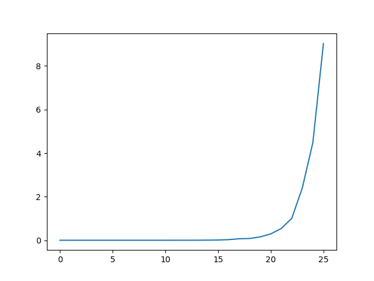
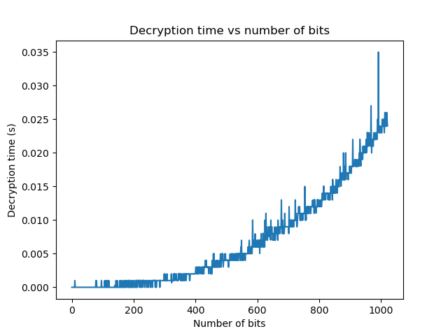
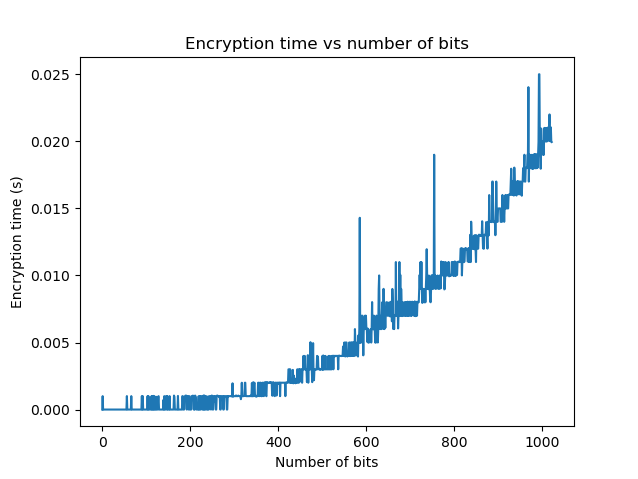

# RSA-Assignment

This is a repository for the RSA assignment.

## How to run the program

1. Clone the repository
2. make sure you have python 3.x installed
3. install required libraries: pycryptodome, matplotlib.
4. To run the chatting program, run the following command in the terminal:

```bash
python chat.py
```

5. To run the attack program and the analysis of encryption/decryption times, run the following command in the terminal:

```bash
python analysis.py
```

## How to use the program

The program is divided into two parts: chatting and attack. The chatting program is used to send and receive encrypted messages. The attack program is used to perform analysis on how the number of bits (Key size) affect the key breaking process. The attack program will generate a graph showing the time taken to break the key along with time taken to encrypt and decrypt the message.

## Conclusion

The analysis shows that the time taken to break the key **increases exponentially** with the increase in the number of bits.



The time taken to encrypt and decrypt the message **increases exponentially** with the increase in the number of bits.




The time taken to break the key is much higher than the time taken to encrypt and decrypt the message because the key breaking process is done using a **brute force method**. This means that the program tries all possible keys to find the correct key. This is why the time taken to break the key increases exponentially with the increase in the number of bits.
