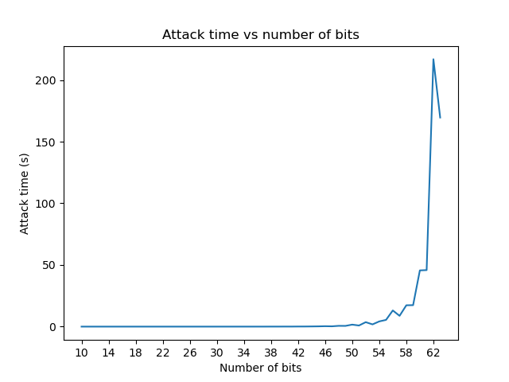
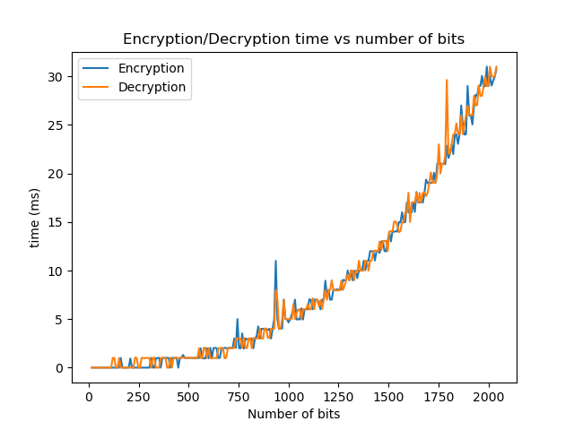

# RSA-Assignment

This is a repository for the RSA assignment.

## How to run the program

1. Clone the repository
2. make sure you have python 3.x installed
3. install required libraries: pycryptodome, matplotlib.
4. To run the chatting program

   1. run the following command in the a terminal:

   ```bash
   python chat.py
   ```

   2. In another terminal run the following command:

   ```bash
    python chat.py
   ```

   3. Port number and keys are generated and shared automatically. you should be able to send message right away.

5. To run the attack program and the analysis of encryption/decryption times, run the following command in the terminal:

```bash
python analysis.py
```

## How to use the program

The program is divided into two parts: chatting and analysis. The chatting program is used to send and receive encrypted messages. The analysis program is used to perform analysis on how the number of bits (Key size) affect the key breaking process using two methods which are **Prime Factorization** and **Brute force**. The analysis program also shows the time taken to encrypt and decrypt the message as well.

## Conclusion

The analysis shows that the time taken to break the key **increases exponentially** with the increase in the number of bits.

The following graph shows the time taken to break the key using prime factorization method:


> Note: When using number of bits below 27 is presented only for for comparison but the message will not be encrypted correctly because the key will be too small to encrypt the message.

The following graph shows the time taken to break the key using brute force method:


We can deduce that the time taken to break the key using prime factorization method is much lower than the time taken to break the key using brute force method. This is because the prime factorization search space is much smaller than the brute force search space. The prime factorization search space is limited to the number of primes less than the key. The brute force search space is limited to the number of possible keys.

Both the encryption and decryption time **increases exponentially** because the time taken to encrypt and decrypt the message is directly proportional to the number of bits in the key.

The following graph shows the time taken to encrypt and decrypt the message:


The time taken to break the key is much higher than the time taken to encrypt and decrypt the message because the key breaking process is done using a **brute force method**. This means that the program tries all possible keys to find the correct key. This is why the time taken to break the key increases exponentially with the increase in the number of bits.
